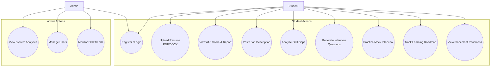
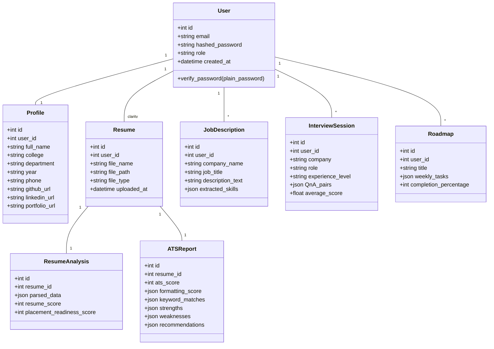
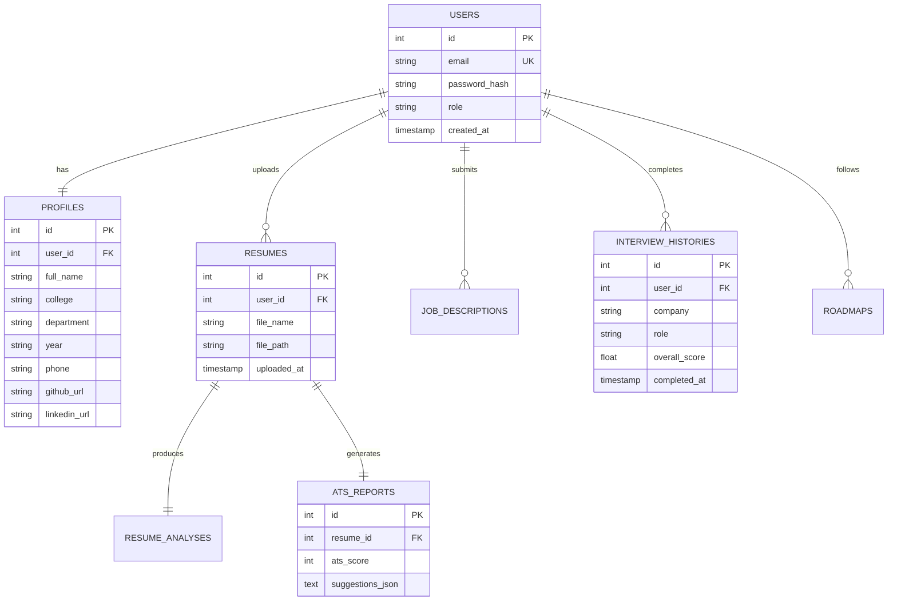
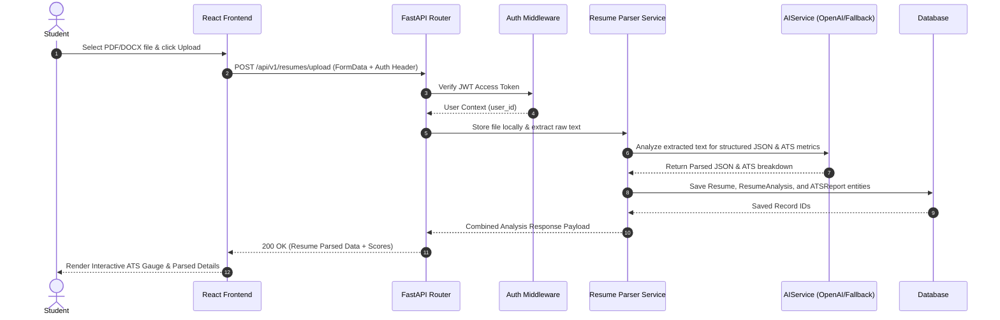
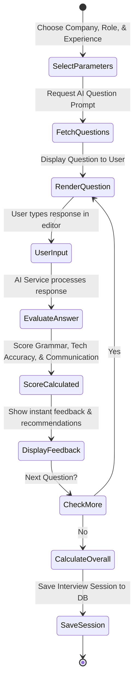
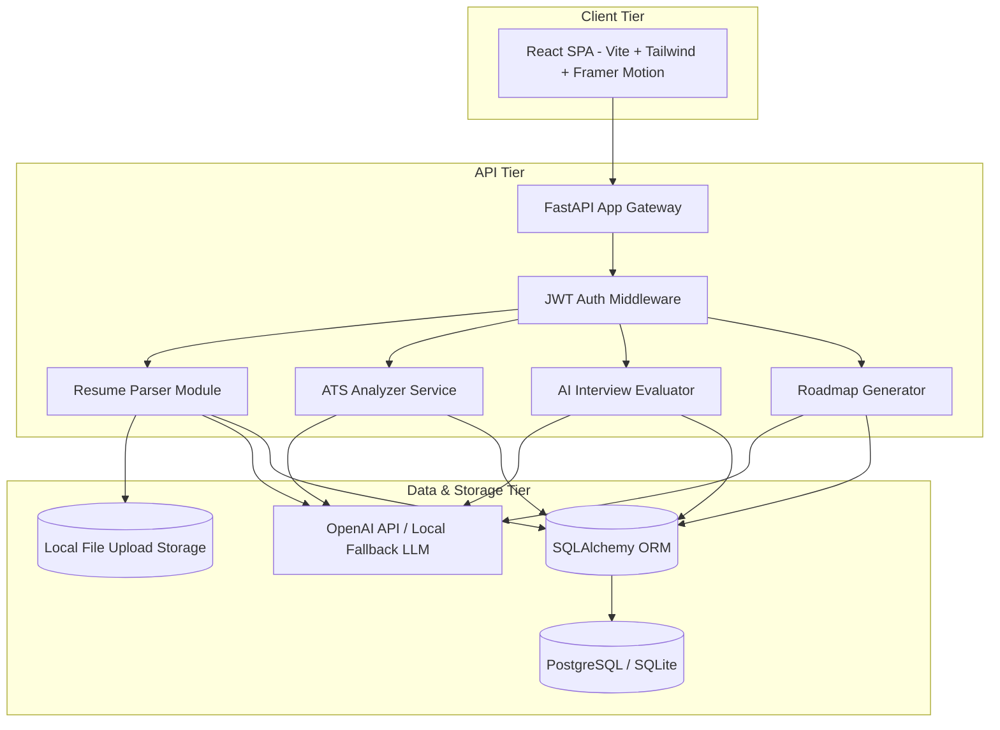
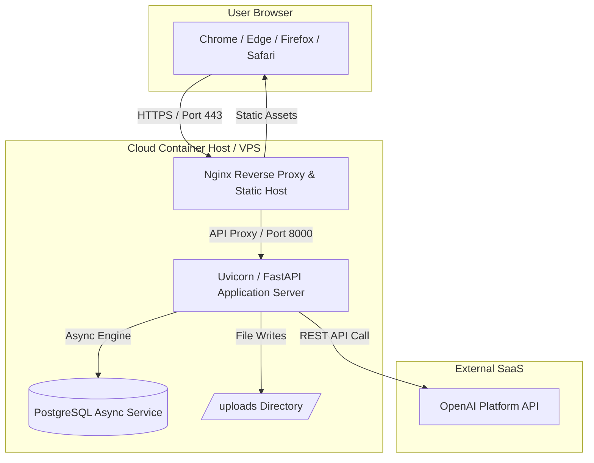
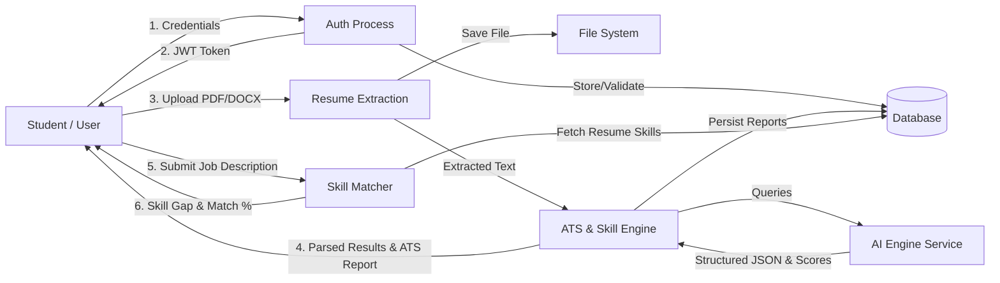
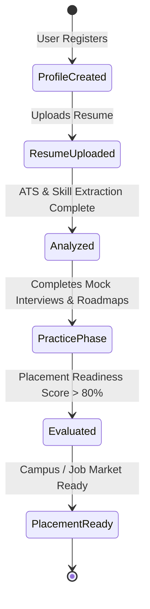

# AI Resume Analyzer & Interview Assistant
## Software Engineering Documentation & Architecture Specification

---

## 1. Requirement Analysis

### 1.1 Functional Requirements (FR)
- **FR1: User Authentication & Role Management**: Users can register with academic metadata (College, Department, Year, Phone), log in securely using JWT tokens, reset passwords, and access role-restricted routes (Student vs. Admin).
- **FR2: Multi-format Resume Upload & Parser Engine**: Students can drag-and-drop or upload PDF/DOCX resume files. The system extracts text and parses structured JSON containing Personal Information, Education, Projects, Work Experience, Skills, Certifications, and Languages.
- **FR3: Comprehensive ATS Analysis**: Evaluates formatting, readability, active verbs, keyword density, section completion, and length. Outputs an ATS score (0-100) with detailed strengths, weaknesses, and actionable recommendations.
- **FR4: Skill Extraction & Job Description Matcher**: Classifies skills into Programming Languages, Frameworks, Cloud, Databases, Developer Tools, and Soft Skills. Users can paste any Job Description to run semantic skill gap analysis and compute a Match Percentage with prioritized missing skills.
- **FR5: Interactive AI Interview Assistant**: Generates customized Technical, HR, Behavioral, System Design, and Project questions tailored to target company, job title, and experience level.
- **FR6: AI Mock Interview Evaluation**: Evaluates user answers in real-time on Technical Accuracy, Communication, Confidence, and Grammar, providing instant constructive feedback and an overall round score.
- **FR7: Dynamic Learning Roadmap**: Generates a week-by-week personalized learning path to bridge identified skill gaps with interactive task checklists.
- **FR8: Placement Readiness Index**: Synthesizes Resume Score, ATS Score, Interview Performance, GitHub/LinkedIn links, and Roadmap Completion into a holistic 0-100 Placement Readiness metric.
- **FR9: Admin Portal**: Enables administrators to monitor system usage, user statistics, average resume/interview scores, daily login traffic, and top trending skills.

### 1.2 Non-Functional Requirements (NFR)
- **NFR1: Performance**: Resume parsing and basic ATS score generation under 2.5 seconds.
- **NFR2: Security**: Passwords salted and hashed with bcrypt; OAuth2 JWT access tokens; CORS, XSS, and SQL injection defenses enforced.
- **NFR3: Scalability & Usability**: Responsive design across Mobile, Tablet, and Desktop displays; glassmorphic UI with dynamic dark/light themes; pluggable LLM interface supporting OpenAI API and offline fallbacks.

---

## 2. System Diagrams

### 2.1 Use Case Diagram
```mermaid
gantt
```
```mermaid
usecaseDiagram
```


---

### 2.2 Class Diagram


---

### 2.3 Entity-Relationship (ER) Diagram


---

### 2.4 Sequence Diagram: Resume Upload & Analysis Flow


---

### 2.5 Activity Diagram: AI Mock Interview Evaluation


---

### 2.6 Component Diagram


---

### 2.7 Deployment Diagram


---

### 2.8 Data Flow Diagram (DFD Level 1)


---

### 2.9 State Diagram: Placement Readiness Lifecycle

